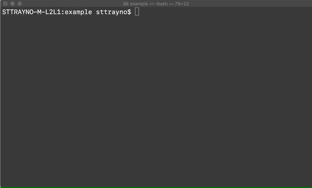
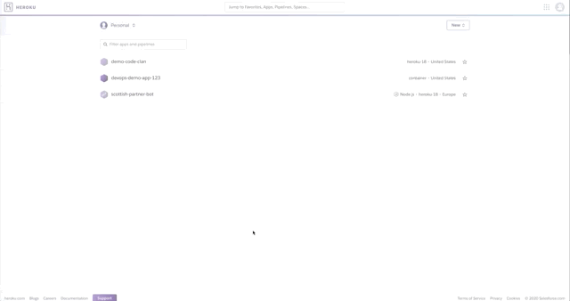

# Deploying Docker images to Heroku 101

Guide for deploying Docker containers in Heroku

## Prerequsites

Before setting off on this guide please ensure you have a Heroku account, if you don't already you can get it from [here](https://id.heroku.com/login). For now just create an account we'll do the rest in our guide.

You'll also need the Heroku CLI tools which you can get from [here](https://devcenter.heroku.com/articles/heroku-cli) or if you're on a mac and have Homebrew installed simply run the below command

```
brew tap heroku/brew && brew install heroku
```

## Exercise 1

Once Heroku CLI tools are installed the next stage is to login to your Heroku account, the command below should launch a web redirect.

```
heroku login
```


We'll also need Docker set up locally to continue. To check this, you should see output when you run this command.

```
$ docker ps
```

Now you can sign into Container Registry, again this should just launch a web redirect and sign you in.

```
$ heroku container:login
```


Before we do anything we need an app within heroku to deploy to, you can do this with the command ```heroku create``` or through the heroku dashboard when you are logged in

``` 
heroku create {YOUR-APP-NAME}
```


Now we're all logged in. it's time push your Docker-based app up to Heroku. This could be done with GCP, AWS or Azure however the process obviously differs between clouds.

Build the Dockerfile in the current directory and push the Docker image. In this example we have a very simple Dockerfile that takes the image from the Docker 201 exercise and simply runs that as is. You can also find this file within the example folder of this repo

```
FROM vismaior89/sinatra-docker-demo:latest
```

Use the following command to push your Docker based app to Heroku. Make sure you're in the same directory as your Dockerfile when you run this command.

```
$ heroku container:push web --app={YOUR-APP-NAME}
````


Deploy the changes

Now to release the newly pushed images to deploy your app.

```
$ heroku container:release web --app={YOUR-APP-NAME}
```




Note: Ensure your Dockerfile has a capital 'D' as the Heroku CLI tooks won't recognise it if you don't. Learn from my wasted few hours on this.

Now naviate to dashboard.heroku.com and find your app from the screens. When you select the app you should be able to navigate to open app on the top right hand corner like the graphic below and see that our simple Web server on our container is working.



Congratulations you've now deployed your app to Heroku!
